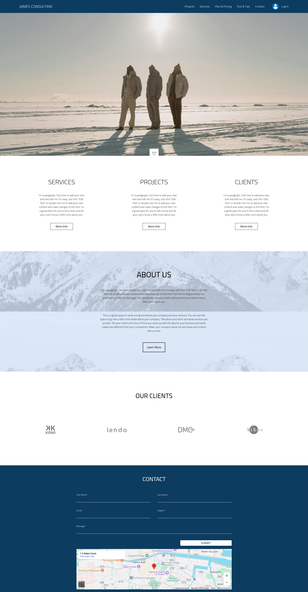

<h1 style='font-weight: bold;'>James Website <h1>
<h3> This website is using the following Technology <h3>
<ul>
    <li>HTML  </li>
    <li>CSS   </li>
    <li>JavaScript   </li>
    <li>React   </li>
    <li>Tailwind CSS   </li>
</ul>

<h2>Website Preview </h2>

<h3 style='display: inline;width: fit-content;'> website link -> </h3> <a href='https://musical-bubblegum-933125.netlify.app/'> James Website</a>
